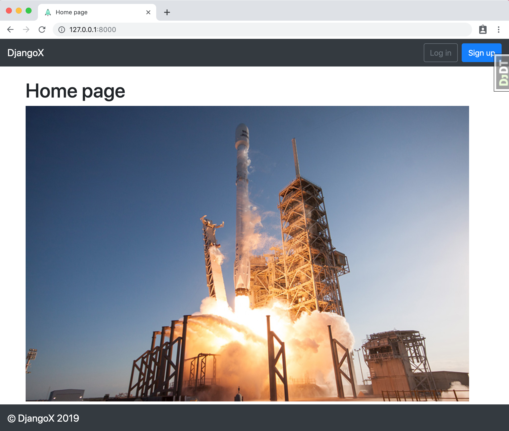
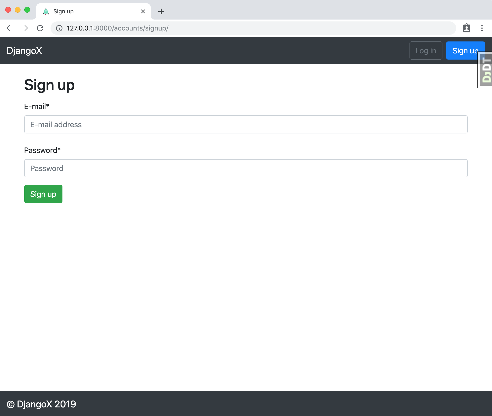

## First-time setup

1.  Make sure Python 3.7x and Pipenv are already installed. [See here for help](https://djangoforbeginners.com/initial-setup/).
2.  Clone the repo and configure the virtual environment:

```
$ git clone https://github.com/wsvincent/djangox.git
$ cd djangox
$ pipenv install
$ pipenv shell
```

3.  Set up the initial migration for our custom user models in `users` and build the database.

```
(djangox) $ python manage.py makemigrations users
(djangox) $ python manage.py migrate
```

4.  Create a superuser:

```
(djangox) $ python manage.py createsuperuser
```

5.  Confirm everything is working:

```
(djangox) $ python manage.py runserver
```

Load the site at [http://127.0.0.1:8000](http://127.0.0.1:8000).





## Next Steps

- Use [PostgreSQL locally via Docker](https://wsvincent.com/django-docker-postgresql/)
- Use [django-environ](https://github.com/joke2k/django-environ) for environment variables
- Update [EMAIL_BACKEND](https://docs.djangoproject.com/en/2.0/topics/email/#module-django.core.mail) to configure an SMTP backend
- Make the [admin more secure](https://opensource.com/article/18/1/10-tips-making-django-admin-more-secure)

## Adding Social Authentication

- [Configuring Google](https://wsvincent.com/django-allauth-tutorial-custom-user-model/#google-credentials)
- [Configuring Facebook](http://www.sarahhagstrom.com/2013/09/the-missing-django-allauth-tutorial/#Create_and_configure_a_Facebook_app)
- [Configuring Github](https://wsvincent.com/django-allauth-tutorial/)
- `django-allauth` supports [many, many other providers in the official docs](https://django-allauth.readthedocs.io/en/latest/providers.html)
